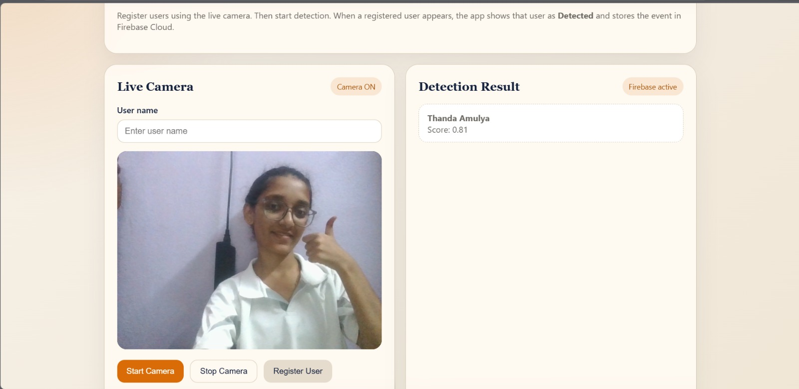
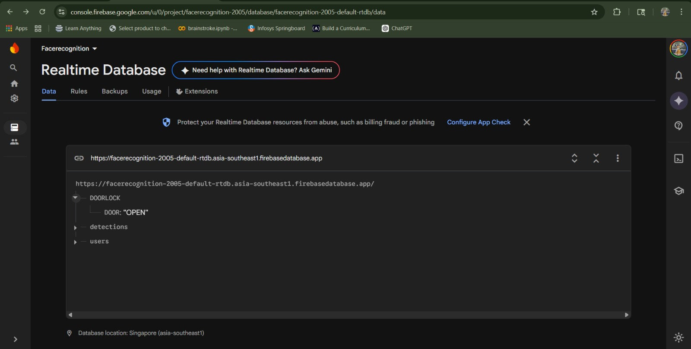
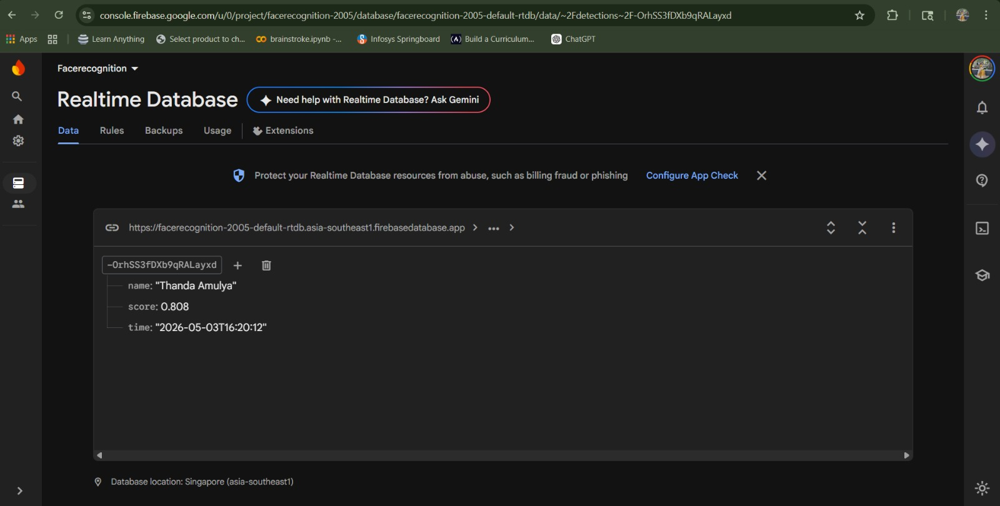
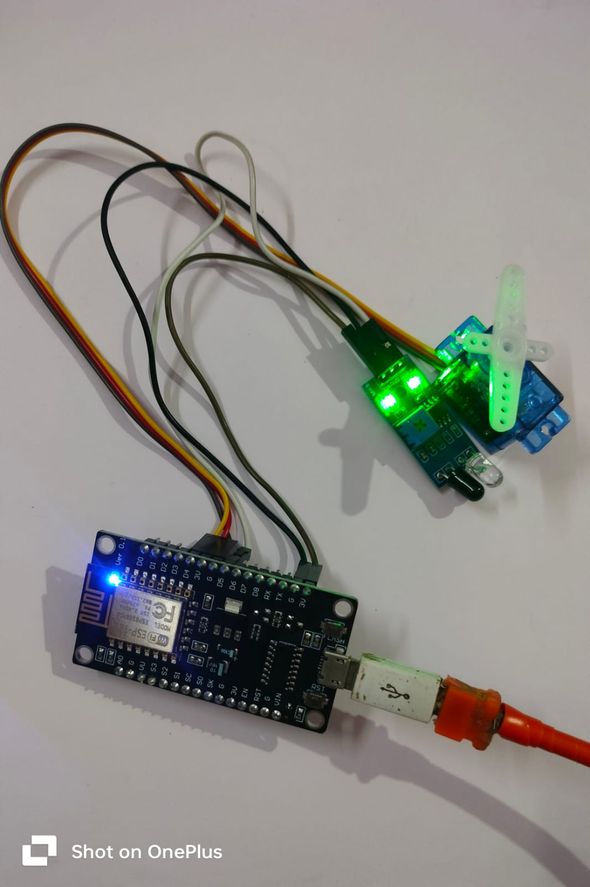
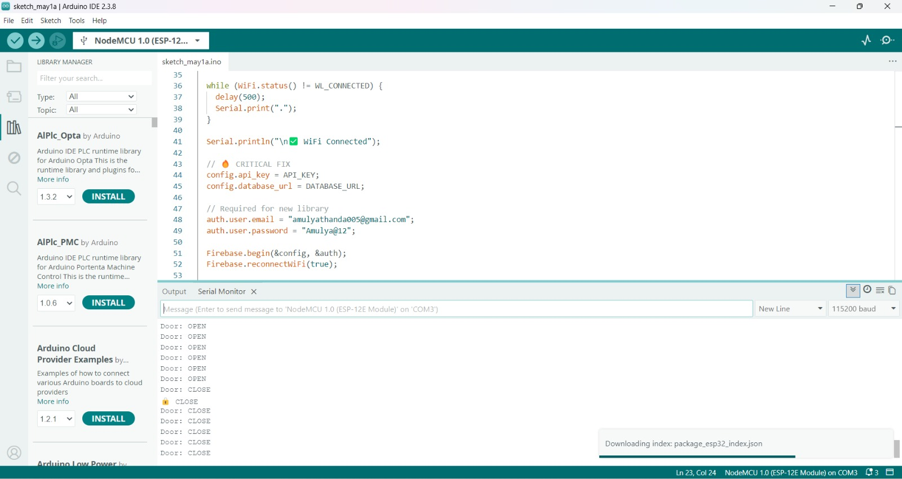

#  Face Recognition Based Smart Door Lock System

An AI + IoT based smart security system that uses **face recognition** to automatically control a **door lock (servo motor via ESP8266)** and log events in **Firebase Realtime Database**.

---

## Features

*  Live camera-based face detection
*  Register multiple users
*  ONNX-based face recognition
*  Firebase Realtime Database integration
*  Automatic door control using ESP8266 + Servo
*  Detection logs stored in cloud
*  Web-based interface (Flask)

---

##  System Flow

```
Camera → Flask Backend → Face Recognition → Firebase → ESP8266 → Servo Motor
```

---

##  Web Application



---

##  Firebase Realtime Database





---

##  Hardware Setup



---

##  Arduino Output



---

##  Technologies Used

* Python (Flask)
* ONNX Runtime
* OpenCV
* Firebase Realtime Database
* ESP8266 (NodeMCU)
* Servo Motor (SG90)
* IR Sensor (optional)

---

##  Setup Instructions

### 1️ Clone Repository

```
git clone https://github.com/your-username/Face_Recognition.git
cd Face_Recognition
```

---

### 2️ Backend Setup

```
python -m venv venv
venv\Scripts\activate
pip install -r requirements.txt
python app.py


---

### 3️ Firebase Setup

* Create Firebase project
* Enable Realtime Database
* Download service account key
* Rename it to:

```
key.json
```

* Place it in project root

---

### 4 Arduino Setup

* Open `Arduino_face_Recognition.ino`
* Enter:

  * WiFi SSID & Password
  * Firebase API Key
  * Database URL
* Upload to ESP8266

---

##  Project Structure

```
Face_Recognition/
│
├── app.py
├── services/
├── static/
├── templates/
│
├── Arduino/
│   └── Arduino_face_Recognition.ino
│
├── Images/
│
├── requirements.txt
└── README.md
```

---

##  Security Note

* Do NOT upload:

  * `key.json`
  * API keys
  * passwords

Use `.gitignore` to protect sensitive data.

---

##  Use Case

* Smart home security
* Office access control
* Attendance systems
* IoT-based automation

---


Amulya Thanda

---

##  Conclusion

This project demonstrates a **real-time AI + IoT system** integrating:

* Computer Vision
* Cloud (Firebase)
* Embedded Systems

to build a **smart and automated door access system**.
